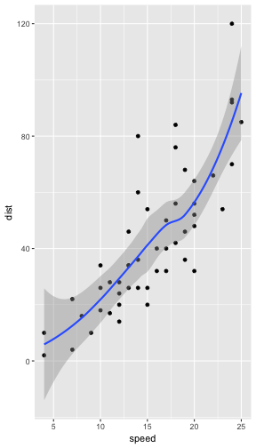

# YAY

Lets test some rmarkdown stuff :D
and if we finish a line with 1 space  

**R version is: 3.3.2**

***

Is it different from finishing a line with 2 spaces?

A bit of R code below:

```r
library(ggplot2)
summary(cars)
```

```
##      speed           dist       
##  Min.   : 4.0   Min.   :  2.00  
##  1st Qu.:12.0   1st Qu.: 26.00  
##  Median :15.0   Median : 36.00  
##  Mean   :15.4   Mean   : 42.98  
##  3rd Qu.:19.0   3rd Qu.: 56.00  
##  Max.   :25.0   Max.   :120.00
```

```r
qplot(speed, dist, data=cars) + 
    geom_smooth()
```


